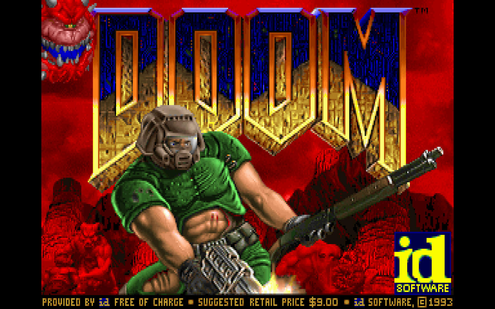

# DOOM (1993) Offline — Doomed Offline: Connection Died

[](https://erik755.github.io/doom-offline/)


<p align="center"></p>

The classic 1993 FPS running **100% offline in the browser** — a "no internet" easter egg packaged as an installable **PWA / Chrome extension**. The game engine is [Chocolate Doom](https://github.com/chocolate-doom/chocolate-doom) compiled to **WebAssembly**; this project provides the web shell, offline caching, touch/gamepad controls, custom WAD loading and localisation.

> *Doom clásico 100 % offline en el navegador (WebAssembly), instalable como PWA/extensión, con soporte para WAD propios.*

**Play:** https://erik755.github.io/doom-offline/

## Features

- Runs fully offline after the first visit (service worker caches engine + data).
- Installable PWA (landscape, standalone) and Chrome extension packaging (`_locales/`).
- **Custom WAD support**: drag & drop your own `.wad`, or reset to the bundled shareware `DOOM1.WAD`.
- On-screen **touch gamepad** toggle for mobile, keyboard controls on desktop.
- UI localised in 9 languages: English, Spanish, Portuguese (BR), French, German, Italian, Japanese, Korean and Simplified Chinese.
- No tracking, no network calls — see [privacy.html](https://erik755.github.io/doom-offline/privacy.html).

## Project structure

```
index.html / styles.css / app.js   web shell, controls, WAD loader, i18n
sw.js / manifest.webmanifest       offline cache and PWA manifest
engine/chocolate-doom.{js,wasm}    Chocolate Doom compiled with Emscripten (GPL-2.0)
engine/chocolate-doom.data         preloaded file system containing the shareware DOOM1.WAD
_locales/                          Chrome extension strings
icons/                             app icons
```

## Run locally

```bash
python3 -m http.server 8080
# open http://localhost:8080 (a local server is required for WebAssembly)
```

## Credits and licensing

- **Chocolate Doom** — © Simon Howard and contributors, GPL-2.0. Source: https://github.com/chocolate-doom/chocolate-doom
- **DOOM engine source** — © id Software, released under the GPL-2.0.
- **DOOM1.WAD (shareware episode)** — © id Software; included unmodified as freely redistributable shareware. DOOM is a trademark of id Software / ZeniMax Media. This project is unofficial and not affiliated with them.
- Web shell, PWA and extension code in this repository — © Erik Sanchez, released under the same **GPL-2.0** license ([LICENSE](LICENSE)) so the combined work stays compatible with the engine.
